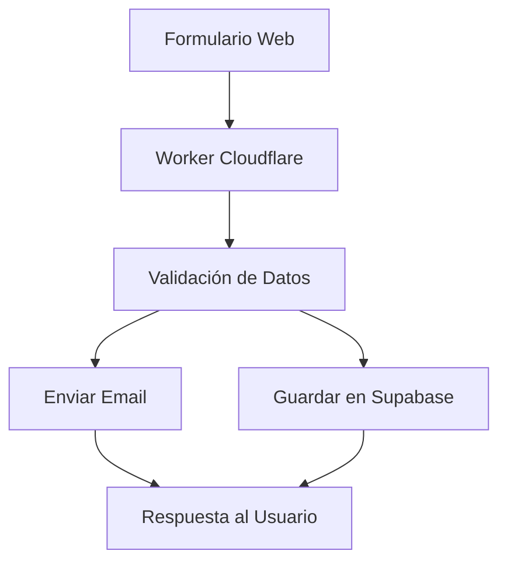

# Especificación: Worker de Cloudflare para Formulario de Contacto

## Resumen del Proyecto

Desarrollo de un worker de Cloudflare que procese los datos del formulario de contacto de la web de NCS Psicóloga, enviando notificaciones por email y almacenando los datos en Supabase.

## Arquitectura General



## 1. Estructura del Worker

### 1.1 Archivos del Proyecto
```
workers/contact-form/
├── src/
│   ├── index.js              # Punto de entrada principal
│   ├── handlers/
│   │   ├── contact.js        # Handler del formulario
│   │   └── health.js         # Health check
│   ├── services/
│   │   ├── email.js          # Servicio de email
│   │   └── supabase.js       # Servicio de Supabase
│   ├── utils/
│   │   ├── validation.js     # Validación de datos
│   │   └── response.js       # Utilidades de respuesta
│   └── config/
│       └── constants.js      # Constantes de configuración
├── wrangler.toml             # Configuración de Wrangler
├── package.json              # Dependencias
└── README.md                 # Documentación
```

### 1.2 Dependencias Principales
```json
{
  "dependencies": {
    "@supabase/supabase-js": "^2.38.0",
    "zod": "^3.22.0"
  },
  "devDependencies": {
    "wrangler": "^3.0.0"
  }
}
```

## 2. Especificación Técnica

### 2.1 Endpoint del Worker
- **URL**: `https://contact-form.ncs-psicologa.workers.dev/api/contact`
- **Método**: `POST`
- **Content-Type**: `application/json`

### 2.2 Estructura de Datos del Formulario

```typescript
interface ContactFormData {
  name: string;           // Nombre completo (requerido)
  email: string;          // Email (requerido, validado)
  phone?: string;         // Teléfono (opcional)
  topic?: string;         // Tipo de consulta (opcional)
  subject: string;        // Asunto (requerido)
  message: string;        // Mensaje (requerido)
  preference: 'email' | 'phone' | 'any'; // Preferencia de contacto
  timestamp?: string;     // Timestamp automático
  ip?: string;           // IP del usuario (opcional)
  userAgent?: string;    // User Agent (opcional)
}
```

### 2.3 Validación de Datos

```javascript
const contactSchema = {
  name: {
    required: true,
    minLength: 2,
    maxLength: 100,
    pattern: /^[a-zA-ZáéíóúÁÉÍÓÚñÑ\s]+$/
  },
  email: {
    required: true,
    pattern: /^[^\s@]+@[^\s@]+\.[^\s@]+$/
  },
  phone: {
    required: false,
    pattern: /^[\+]?[0-9\s\-\(\)]{9,15}$/
  },
  subject: {
    required: true,
    minLength: 5,
    maxLength: 200
  },
  message: {
    required: true,
    minLength: 10,
    maxLength: 2000
  },
  preference: {
    required: true,
    enum: ['email', 'phone', 'any']
  }
};
```

## 3. Servicios de Integración

### 3.1 Servicio de Email

**Proveedor**: Resend (recomendado) o SendGrid

#### Configuración de Resend
```javascript
const emailConfig = {
  apiKey: 're_xxxxxxxxx', // Variable de entorno
  from: 'noreply@ncs-psicologa.com',
  to: 'nelly@ncs-psicologa.com',
  replyTo: '{{email}}' // Email del formulario
};
```

#### Template de Email
```html
<!DOCTYPE html>
<html>
<head>
  <meta charset="utf-8">
  <title>Nueva consulta - NCS Psicóloga</title>
</head>
<body>
  <h2>Nueva consulta recibida</h2>
  
  <h3>Datos del contacto:</h3>
  <ul>
    <li><strong>Nombre:</strong> {{name}}</li>
    <li><strong>Email:</strong> {{email}}</li>
    <li><strong>Teléfono:</strong> {{phone || 'No proporcionado'}}</li>
    <li><strong>Tipo de consulta:</strong> {{topic || 'No especificado'}}</li>
    <li><strong>Preferencia de contacto:</strong> {{preference}}</li>
  </ul>
  
  <h3>Mensaje:</h3>
  <p><strong>Asunto:</strong> {{subject}}</p>
  <p>{{message}}</p>
  
  <hr>
  <p><small>Enviado el {{timestamp}} desde {{ip}}</small></p>
</body>
</html>
```

### 3.2 Servicio de Supabase

#### Configuración de la Base de Datos

**Tabla: `contact_submissions`**
```sql
CREATE TABLE contact_submissions (
  id UUID DEFAULT gen_random_uuid() PRIMARY KEY,
  name VARCHAR(100) NOT NULL,
  email VARCHAR(255) NOT NULL,
  phone VARCHAR(20),
  topic VARCHAR(100),
  subject VARCHAR(200) NOT NULL,
  message TEXT NOT NULL,
  preference VARCHAR(10) NOT NULL CHECK (preference IN ('email', 'phone', 'any')),
  ip_address INET,
  user_agent TEXT,
  created_at TIMESTAMP WITH TIME ZONE DEFAULT NOW(),
  updated_at TIMESTAMP WITH TIME ZONE DEFAULT NOW(),
  status VARCHAR(20) DEFAULT 'new' CHECK (status IN ('new', 'read', 'replied', 'archived'))
);

-- Índices para optimizar consultas
CREATE INDEX idx_contact_submissions_email ON contact_submissions(email);
CREATE INDEX idx_contact_submissions_created_at ON contact_submissions(created_at);
CREATE INDEX idx_contact_submissions_status ON contact_submissions(status);

-- RLS (Row Level Security)
ALTER TABLE contact_submissions ENABLE ROW LEVEL SECURITY;

-- Política para permitir inserción desde el worker
CREATE POLICY "Allow worker insert" ON contact_submissions
  FOR INSERT WITH CHECK (true);

-- Política para lectura (solo para usuarios autenticados)
CREATE POLICY "Allow authenticated read" ON contact_submissions
  FOR SELECT USING (auth.role() = 'authenticated');
```

#### Configuración del Cliente Supabase
```javascript
const supabaseConfig = {
  url: 'https://xxxxxxxxx.supabase.co',
  anonKey: 'eyJhbGciOiJIUzI1NiIsInR5cCI6IkpXVCJ9...', // Variable de entorno
  serviceRoleKey: 'eyJhbGciOiJIUzI1NiIsInR5cCI6IkpXVCJ9...' // Para operaciones del worker
};
```

## 4. Configuración del Worker

### 4.1 wrangler.toml
```toml
name = "contact-form-worker"
main = "src/index.js"
compatibility_date = "2024-01-15"

[env.production]
vars = { ENVIRONMENT = "production" }

[env.staging]
vars = { ENVIRONMENT = "staging" }

# Variables de entorno (secrets)
# wrangler secret put RESEND_API_KEY
# wrangler secret put SUPABASE_URL
# wrangler secret put SUPABASE_ANON_KEY
# wrangler secret put SUPABASE_SERVICE_ROLE_KEY
# wrangler secret put CONTACT_EMAIL_TO
# wrangler secret put CONTACT_EMAIL_FROM
```

### 4.2 Variables de Entorno Requeridas
```bash
# Email
RESEND_API_KEY=re_xxxxxxxxx
CONTACT_EMAIL_TO=nelly@ncs-psicologa.com
CONTACT_EMAIL_FROM=noreply@ncs-psicologa.com

# Supabase
SUPABASE_URL=https://xxxxxxxxx.supabase.co
SUPABASE_ANON_KEY=eyJhbGciOiJIUzI1NiIsInR5cCI6IkpXVCJ9...
SUPABASE_SERVICE_ROLE_KEY=eyJhbGciOiJIUzI1NiIsInR5cCI6IkpXVCJ9...

# Seguridad
CORS_ORIGIN=https://ncs-psicologa.com
RATE_LIMIT_MAX=10
RATE_LIMIT_WINDOW=3600
```

## 5. Flujo de Procesamiento

### 5.1 Proceso Principal
1. **Recepción**: Worker recibe POST con datos del formulario
2. **Validación**: Validar estructura y contenido de los datos
3. **Rate Limiting**: Verificar límites de envío por IP
4. **Sanitización**: Limpiar datos de entrada
5. **Procesamiento Paralelo**:
   - Enviar email de notificación
   - Guardar en base de datos Supabase
6. **Respuesta**: Retornar confirmación al usuario

### 5.2 Manejo de Errores
```javascript
const errorResponses = {
  VALIDATION_ERROR: { status: 400, message: 'Datos del formulario inválidos' },
  RATE_LIMIT_EXCEEDED: { status: 429, message: 'Demasiados envíos. Intenta más tarde' },
  EMAIL_SEND_FAILED: { status: 500, message: 'Error enviando email' },
  DATABASE_ERROR: { status: 500, message: 'Error guardando datos' },
  INTERNAL_ERROR: { status: 500, message: 'Error interno del servidor' }
};
```

## 6. Seguridad

### 6.1 Medidas de Seguridad
- **CORS**: Configurado para dominio específico
- **Rate Limiting**: Máximo 10 envíos por IP por hora
- **Validación**: Sanitización de todos los inputs
- **HTTPS**: Solo conexiones seguras
- **Headers de Seguridad**: CSP, HSTS, etc.

### 6.2 Protección contra Spam
- Validación de formato de email
- Verificación de campos requeridos
- Rate limiting por IP
- Sanitización de contenido HTML

## 7. Monitoreo y Logs

### 7.1 Métricas a Monitorear
- Número de envíos por día/semana
- Tasa de éxito de envíos
- Errores por tipo
- Tiempo de respuesta del worker

### 7.2 Logs Estructurados
```javascript
const logEntry = {
  timestamp: new Date().toISOString(),
  level: 'info',
  event: 'contact_form_submission',
  data: {
    email: contactData.email,
    subject: contactData.subject,
    ip: request.headers.get('CF-Connecting-IP'),
    userAgent: request.headers.get('User-Agent'),
    success: true
  }
};
```

## 8. Instrucciones de Implementación

### 8.1 Configuración de Supabase

#### Paso 1: Crear Proyecto
1. Ir a [supabase.com](https://supabase.com)
2. Crear nuevo proyecto
3. Anotar URL y claves de API

#### Paso 2: Configurar Base de Datos
```sql
-- Ejecutar en el SQL Editor de Supabase
-- (Ver script SQL en sección 3.2)
```

#### Paso 3: Configurar RLS
- Habilitar Row Level Security
- Crear políticas de acceso
- Configurar autenticación si es necesario

### 8.2 Configuración de Email (Resend)

#### Paso 1: Crear Cuenta
1. Ir a [resend.com](https://resend.com)
2. Crear cuenta y verificar dominio
3. Obtener API key

#### Paso 2: Configurar Dominio
1. Agregar registros DNS
2. Verificar dominio
3. Configurar DKIM/SPF

### 8.3 Despliegue del Worker

#### Paso 1: Preparar Código
```bash
cd workers/contact-form
npm install
```

#### Paso 2: Configurar Secrets
```bash
wrangler secret put RESEND_API_KEY
wrangler secret put SUPABASE_URL
wrangler secret put SUPABASE_SERVICE_ROLE_KEY
# ... otros secrets
```

#### Paso 3: Desplegar
```bash
wrangler deploy
```

### 8.4 Configuración del Frontend

#### Modificar Formulario de Contacto
```javascript
// En ContactCTA.astro, cambiar el action del formulario
const action = 'https://contact-form.ncs-psicologa.workers.dev/api/contact';

// Agregar JavaScript para envío AJAX
const form = document.getElementById('contact-form');
form.addEventListener('submit', async (e) => {
  e.preventDefault();
  
  const formData = new FormData(form);
  const data = Object.fromEntries(formData.entries());
  
  try {
    const response = await fetch(action, {
      method: 'POST',
      headers: {
        'Content-Type': 'application/json',
      },
      body: JSON.stringify(data)
    });
    
    if (response.ok) {
      // Mostrar mensaje de éxito
      showSuccessMessage();
    } else {
      // Mostrar mensaje de error
      showErrorMessage();
    }
  } catch (error) {
    showErrorMessage();
  }
});
```

## 9. Testing

### 9.1 Tests Unitarios
- Validación de datos
- Servicios de email
- Servicios de Supabase
- Utilidades de respuesta

### 9.2 Tests de Integración
- Flujo completo del worker
- Integración con Resend
- Integración con Supabase

### 9.3 Tests de Carga
- Rate limiting
- Manejo de múltiples requests
- Performance bajo carga

## 10. Mantenimiento

### 10.1 Tareas Regulares
- Revisar logs de errores
- Monitorear métricas de envío
- Actualizar dependencias
- Backup de base de datos

### 10.2 Escalabilidad
- Considerar migración a D1 para rate limiting
- Implementar cache si es necesario
- Optimizar queries de Supabase

## 11. Costos Estimados

### 11.1 Cloudflare Workers
- **Gratis**: 100,000 requests/día
- **Pro**: $5/mes por 10M requests

### 11.2 Resend
- **Gratis**: 3,000 emails/mes
- **Pro**: $20/mes por 50,000 emails

### 11.3 Supabase
- **Gratis**: 500MB base de datos
- **Pro**: $25/mes por 8GB

**Total estimado**: $0-50/mes dependiendo del volumen

---

## Próximos Pasos

1. ✅ Crear especificación detallada
2. ⏳ Configurar proyecto Supabase
3. ⏳ Configurar servicio de email
4. ⏳ Desarrollar worker de Cloudflare
5. ⏳ Implementar tests
6. ⏳ Desplegar y configurar
7. ⏳ Integrar con frontend
8. ⏳ Monitorear y optimizar
